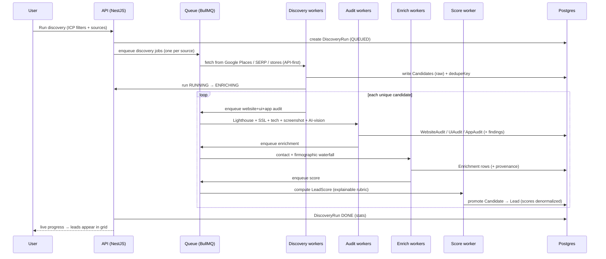
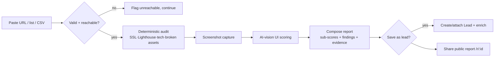
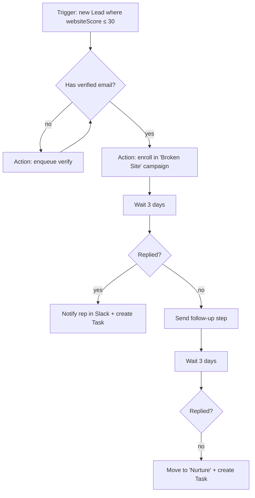
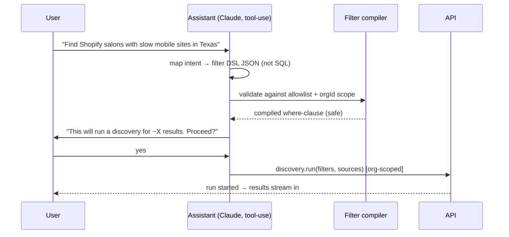

# 03 — User Flows

The critical paths, as sequences. Each maps to routes (Doc 02), APIs (Doc 08), and queues (Doc 11).

---

## 1. Onboarding → activation (the make-or-break path)

```mermaid
flowchart TD
  A[Sign up / accept invite] --> B[Create or join Org]
  B --> C[Guided ICP wizard:\nwho do you help?]
  C --> D[Pick sources + geo + niche]
  D --> E[Preview estimated results]
  E --> F[Run first discovery]
  F --> G[Audits + enrichment run in queue]
  G --> H[Leads land in database\nwith scores + screenshots]
  H --> I[Connect a mailbox\n(Gmail/Outlook/SMTP)]
  I --> J[Send first personalized sequence]
  J --> K[✅ Activated: first sequence sent]
```

**Design intent:** get to *"whoa, it found real broken sites for me"* before asking for a mailbox. The first
discovery must return visible, audited, screenshotted leads even on the FREE plan (capped volume). Activation
milestone = **first sequence sent within 7 days** (PRD §7).

**Empty-state ladder:** Dashboard empty → "Run your first discovery" → Leads empty → same CTA → after first run,
AI Recommendation card appears: "12 leads score ≥ 80 and are unassigned — start a sequence?"

---

## 2. Discovery → audit → lead (the core engine loop)



**Key rules:** dedupe by canonical domain (fallback name+geo hash) *before* spending audit/enrich credits;
audits are cached with a TTL so re-discovering a known domain reuses recent results; every credit-spending
step writes a `UsageEvent` (Doc 17 metering).

---

## 3. Website Scanner (ad-hoc / bulk)



The **public report** (`/r/:publicId`) is branded with the org's logo/color and is the growth loop — it's the
artifact the agency pastes into a cold email or DMs to a prospect.

---

## 4. Filter → shortlist → sequence (the daily SDR loop)

```mermaid
flowchart TD
  A[Open Lead Database] --> B[Apply filter tree\nleadScore≥70 · websiteScore≤40 · US · email VALID]
  B --> C[Save as smart segment]
  C --> D[Select all matching]
  D --> E[Bulk: add to Campaign]
  E --> F{Contacts have verified email?}
  F -- no --> F1[Bulk verify first]
  F -- yes --> G[Enroll → Sequence]
  G --> H[AI writes step 1 per lead\nusing audit.topFinding]
  H --> I[Send from connected mailbox\n(throttled, windowed)]
  I --> J[Track open/click/reply]
  J --> K{Reply?}
  K -- yes --> L[Pause sequence · notify rep · create task]
  K -- no --> M[Wait delay → next step]
```

Suppression + unsubscribe are checked at enroll *and* at send. A reply always pauses the enrollment.

---

## 5. Automation-driven loop (hands-off mode)



This is the visual builder graph stored in `Workflow.graph` (Doc 12), executed by the workflow worker via the
queue with a per-run log.

---

## 6. AI Assistant flow (NL → safe action)



Writes always confirm; the LLM never touches the DB directly — it emits the Filter DSL (Doc 04 §11) and calls
allowlisted, org-scoped tools (Doc 09). No cross-tenant access is representable.

---

## 7. Team & permissions flow

Owner invites → invitee accepts `/invite/:token` → Membership created with role → role gates every mutation
(Doc 14). Sensitive actions (delete, role change, export, impersonate) write to `AuditLog`. Viewers can read
and export within limits but cannot send, delete, or change roles.

---

## 8. Failure & recovery paths (designed, not hoped)

| Failure | Behavior |
|---|---|
| Provider rate-limited / down | Job retries with backoff; run marked `PARTIAL`; user sees which sources succeeded |
| Site unreachable / times out | Audit marked `FAILED` with reason; lead still created if identity known; re-audit schedulable |
| Enrichment miss (no contact found) | Lead flagged "needs contact"; excluded from send-eligible segments |
| Email verify = INVALID | Contact badged; blocked from sequences; suggestion to find alt contact |
| Mailbox disconnected mid-campaign | Enrollments pause; user notified to reconnect; no data lost |
| Usage cap hit | Soft warning at 80%, hard stop at 100% with upgrade CTA; in-flight jobs finish |
