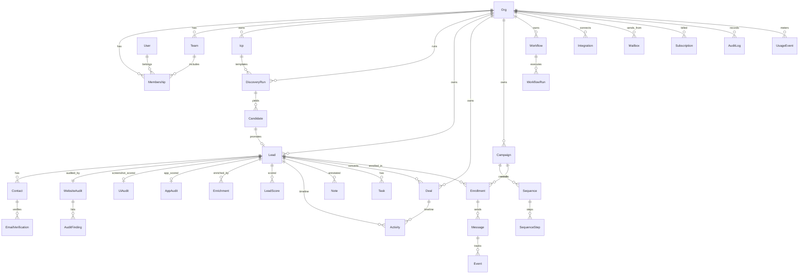

# 04 — Database Schema + ER Diagram

PostgreSQL 16 + Prisma. This is the source of truth for every table. It becomes `packages/db/prisma/schema.prisma`.

**Conventions**
- Every tenant-scoped row carries `orgId` (FK → `Org`) — enforced at the query layer *and* by Postgres Row-Level Security (Doc 14).
- IDs: `cuid()` strings (`id`). Timestamps: `createdAt`, `updatedAt` on every table.
- Soft-delete via `deletedAt` on user-facing entities (Lead, Deal, Campaign, Contact).
- Money stored as integer **minor units** + `currency` (never floats).
- Enums are Postgres enums via Prisma `enum`.
- Big/append-only tables (`Activity`, `Event`, `AuditLog`) are **partitioned by month** (Doc 15).
- Semantic search columns use `pgvector` (`vector(1536)`), separate from OLTP.

---

## 1. ER diagram (core)



---

## 2. Identity, tenancy & access

```prisma
model Org {
  id          String   @id @default(cuid())
  name        String
  slug        String   @unique
  logoUrl     String?
  brandColor  String?           // used on public reports + emails
  plan        Plan     @default(FREE)
  status      OrgStatus @default(ACTIVE)
  createdAt   DateTime @default(now())
  updatedAt   DateTime @updatedAt

  memberships Membership[]
  teams       Team[]
  icps        Icp[]
  runs        DiscoveryRun[]
  leads       Lead[]
  deals       Deal[]
  campaigns   Campaign[]
  workflows   Workflow[]
  integrations Integration[]
  mailboxes   Mailbox[]
  subscription Subscription?
  auditLogs   AuditLog[]
  usageEvents UsageEvent[]
  apiKeys     ApiKey[]
}

model User {
  id           String   @id @default(cuid())
  email        String   @unique
  name         String?
  avatarUrl    String?
  passwordHash String?          // null if SSO-only
  isStaff      Boolean  @default(false)   // platform admin scope
  lastLoginAt  DateTime?
  createdAt    DateTime @default(now())
  updatedAt    DateTime @updatedAt

  memberships  Membership[]
  sessions     Session[]
}

model Membership {
  id      String @id @default(cuid())
  orgId   String
  userId  String
  teamId  String?
  role    Role   @default(MEMBER)
  invitedById String?
  createdAt DateTime @default(now())

  org   Org   @relation(fields: [orgId], references: [id], onDelete: Cascade)
  user  User  @relation(fields: [userId], references: [id], onDelete: Cascade)
  team  Team? @relation(fields: [teamId], references: [id])

  @@unique([orgId, userId])
  @@index([orgId])
}

model Team {
  id     String @id @default(cuid())
  orgId  String
  name   String
  org    Org    @relation(fields: [orgId], references: [id], onDelete: Cascade)
  memberships Membership[]
  @@index([orgId])
}

model Session {
  id        String   @id @default(cuid())
  userId    String
  activeOrgId String?
  ip        String?
  userAgent String?
  expiresAt DateTime
  createdAt DateTime @default(now())
  user      User     @relation(fields: [userId], references: [id], onDelete: Cascade)
  @@index([userId])
}

model Invitation {
  id        String   @id @default(cuid())
  orgId     String
  email     String
  role      Role     @default(MEMBER)
  token     String   @unique
  acceptedAt DateTime?
  expiresAt DateTime
  createdAt DateTime @default(now())
  @@index([orgId])
}

enum Role { OWNER ADMIN MANAGER MEMBER VIEWER }
enum Plan { FREE STARTER GROWTH SCALE ENTERPRISE }
enum OrgStatus { ACTIVE PAST_DUE SUSPENDED }
```

---

## 3. Discovery

```prisma
model Icp {                       // saved Ideal Customer Profile
  id        String   @id @default(cuid())
  orgId     String
  name      String
  filters   Json                 // normalized filter tree (see §Filter DSL below)
  sources   String[]             // ["google_places","serp","play_store",...]
  schedule  String?              // cron; null = manual
  isActive  Boolean  @default(true)
  createdBy String
  createdAt DateTime @default(now())
  updatedAt DateTime @updatedAt
  org       Org      @relation(fields: [orgId], references: [id], onDelete: Cascade)
  runs      DiscoveryRun[]
  @@index([orgId])
}

model DiscoveryRun {
  id         String   @id @default(cuid())
  orgId      String
  icpId      String?
  status     RunStatus @default(QUEUED)
  sources    String[]
  filters    Json
  stats      Json?               // {found, deduped, queuedAudits, enriched, errors}
  startedAt  DateTime?
  finishedAt DateTime?
  error      String?
  createdBy  String
  createdAt  DateTime @default(now())
  org        Org      @relation(fields: [orgId], references: [id], onDelete: Cascade)
  icp        Icp?     @relation(fields: [icpId], references: [id])
  candidates Candidate[]
  @@index([orgId, status])
}

model Candidate {                 // raw pre-lead result before promotion/dedupe
  id          String   @id @default(cuid())
  orgId       String
  runId       String
  source      String
  rawName     String?
  domain      String?             // canonicalized
  url         String?
  phone       String?
  category    String?
  geo         Json?               // {country,state,city,zip,lat,lng}
  raw         Json                // provider payload, untouched
  dedupeKey   String              // hash(domain || name+geo)
  status      CandidateStatus @default(NEW)
  leadId      String?             // set when promoted
  createdAt   DateTime @default(now())
  run         DiscoveryRun @relation(fields: [runId], references: [id], onDelete: Cascade)
  @@unique([orgId, dedupeKey])
  @@index([orgId, status])
}

enum RunStatus { QUEUED RUNNING ENRICHING DONE FAILED PARTIAL }
enum CandidateStatus { NEW DUPLICATE PROMOTED REJECTED }
```

---

## 4. Leads & contacts (the heart)

```prisma
model Lead {
  id            String   @id @default(cuid())
  orgId         String
  // identity
  company       String
  businessName  String?
  domain        String?            // canonical; unique per org
  website       String?
  ownerName     String?
  // classification
  industry      String?
  category      String?
  opportunityType OpportunityType[]   // BROKEN_SITE, OUTDATED, SLOW, NO_SSL, BAD_UX, SEO, NO_ECOMM, APP_POOR ...
  // geo
  country       String?
  state         String?
  city          String?
  zip           String?
  lat           Float?
  lng           Float?
  // firmographics (from enrichment; provenance in Enrichment rows)
  employees     Int?
  revenueMinor  BigInt?
  currency      String?  @default("USD")
  techStack     String[]           // fingerprinted
  cms           String?
  hosting       String?
  domainAgeDays Int?
  trafficBand   String?            // "0-1k","1k-10k",...
  // scores (denormalized latest for fast sort/filter)
  leadScore     Int?               // 0-100
  websiteScore  Int?
  uiScore       Int?
  seoScore      Int?
  appScore      Int?
  // app links
  playStoreUrl  String?
  appStoreUrl   String?
  // workflow
  stage         Stage    @default(NEW)
  status        LeadStatus @default(ACTIVE)
  assignedToId  String?
  tags          String[]
  // audit refs (latest)
  screenshotUrl String?
  // meta
  source        String?
  createdBy     String?
  createdAt     DateTime @default(now())
  updatedAt     DateTime @updatedAt
  deletedAt     DateTime?

  org          Org      @relation(fields: [orgId], references: [id], onDelete: Cascade)
  contacts     Contact[]
  websiteAudit WebsiteAudit?
  uiAudit      UiAudit?
  appAudit     AppAudit?
  enrichments  Enrichment[]
  scores       LeadScore[]
  activities   Activity[]
  notes        Note[]
  tasks        Task[]
  deals        Deal[]
  enrollments  Enrollment[]

  @@unique([orgId, domain])
  @@index([orgId, stage])
  @@index([orgId, leadScore])
  @@index([orgId, websiteScore])
  @@index([orgId, country, industry])
  @@index([orgId, assignedToId])
}

model Contact {
  id         String  @id @default(cuid())
  orgId      String
  leadId     String
  fullName   String?
  title      String?          // "Founder","Marketing Head","IT Head"...
  role       DecisionRole?    // CEO FOUNDER MARKETING IT SALES OTHER
  email      String?
  emailStatus VerifyStatus?   // denormalized latest
  emailConfidence Int?
  phone      String?
  whatsapp   String?
  linkedin   String?
  facebook   String?
  instagram  String?
  twitter    String?
  isPrimary  Boolean @default(false)
  source     String?
  createdAt  DateTime @default(now())
  updatedAt  DateTime @updatedAt
  deletedAt  DateTime?
  lead       Lead    @relation(fields: [leadId], references: [id], onDelete: Cascade)
  verifications EmailVerification[]
  @@index([orgId, leadId])
  @@index([orgId, email])
}

enum OpportunityType { BROKEN_SITE OUTDATED SLOW NO_SSL NOT_RESPONSIVE BAD_UX SEO NO_ECOMMERCE POOR_BRANDING NO_SOCIAL APP_POOR APP_STALE DIGITAL_TRANSFORM }
enum Stage { NEW RESEARCH CONTACTED MEETING PROPOSAL NEGOTIATION WON LOST }
enum LeadStatus { ACTIVE ARCHIVED DUPLICATE DO_NOT_CONTACT }
enum DecisionRole { CEO FOUNDER MARKETING IT SALES OPERATIONS OTHER }
```

---

## 5. Audits (deterministic + AI)

```prisma
model WebsiteAudit {
  id            String   @id @default(cuid())
  orgId         String
  leadId        String   @unique
  url           String
  // deterministic facts (NEVER LLM-sourced)
  sslValid      Boolean?
  sslExpiresAt  DateTime?
  httpsRedirect Boolean?
  perfScore     Int?              // Lighthouse 0-100
  lcpMs         Int?
  clsScore      Float?
  inpMs         Int?
  ttfbMs        Int?
  pageWeightKb  Int?
  brokenImages  Int?
  brokenLinks   Int?
  has404        Boolean?
  hasTitle      Boolean?
  hasMetaDesc   Boolean?
  hasOg         Boolean?
  hasSchema     Boolean?
  hasSitemap    Boolean?
  hasRobots     Boolean?
  hasAnalytics  Boolean?
  hasPixel      Boolean?
  hasLiveChat   Boolean?
  hasConsentBanner Boolean?
  hasContactForm Boolean?
  hasCta        Boolean?
  mobileViewport Boolean?
  isEcommerce   Boolean?
  hasBlog       Boolean?
  hasPrivacy    Boolean?
  hasTerms      Boolean?
  securityHeaders Json?           // {hsts,csp,xfo,...}
  techStack     String[]
  cms           String?
  hosting       String?
  domainAgeDays Int?
  // sub-scores derived deterministically
  seoScore      Int?
  perfSubScore  Int?
  securityScore Int?
  accessibilityScore Int?
  overallScore  Int?
  rawLighthouse Json?
  screenshotUrl String?
  status        AuditStatus @default(PENDING)
  error         String?
  fetchedAt     DateTime?
  createdAt     DateTime @default(now())
  lead          Lead     @relation(fields: [leadId], references: [id], onDelete: Cascade)
  findings      AuditFinding[]
  @@index([orgId])
}

model AuditFinding {
  id         String  @id @default(cuid())
  auditId    String
  code       String            // "NO_SSL","LCP_SLOW","MISSING_SCHEMA"...
  severity   Severity          // CRITICAL HIGH MEDIUM LOW INFO
  title      String
  detail     String
  evidence   Json?             // {selector, value, threshold}
  category   String            // performance|security|seo|ux|content|legal
  audit      WebsiteAudit @relation(fields: [auditId], references: [id], onDelete: Cascade)
  @@index([auditId])
}

model UiAudit {                 // AI-vision on screenshots
  id           String  @id @default(cuid())
  orgId        String
  leadId       String  @unique
  uiScore      Int?
  uxScore      Int?
  trustScore   Int?
  brandingScore Int?
  conversionScore Int?
  modernScore  Int?
  summary      String?
  recommendations Json?         // [{title, rationale, evidenceRegion, priority}]
  model        String?          // "claude-opus-4-8"
  screenshotUrl String?
  status       AuditStatus @default(PENDING)
  createdAt    DateTime @default(now())
  lead         Lead    @relation(fields: [leadId], references: [id], onDelete: Cascade)
  @@index([orgId])
}

model AppAudit {
  id           String  @id @default(cuid())
  orgId        String
  leadId       String  @unique
  store        AppStore          // PLAY APPLE
  appId        String            // package id / bundle id
  title        String?
  rating       Float?
  ratingsCount Int?
  lastUpdated  DateTime?
  version      String?
  staleDays    Int?
  reviewSentiment Float?         // -1..1 sampled
  screenshotCritique Json?
  opportunityScore Int?
  raw          Json?
  status       AuditStatus @default(PENDING)
  createdAt    DateTime @default(now())
  lead         Lead    @relation(fields: [leadId], references: [id], onDelete: Cascade)
  @@index([orgId])
}

enum AuditStatus { PENDING RUNNING DONE FAILED }
enum Severity { CRITICAL HIGH MEDIUM LOW INFO }
enum AppStore { PLAY APPLE }
```

---

## 6. Enrichment, verification & scoring

```prisma
model Enrichment {
  id         String   @id @default(cuid())
  orgId      String
  leadId     String
  provider   String            // "clearbit","hunter","apollo","peopledatalabs"...
  field      String            // "email","employees","revenue","linkedin"...
  value      Json
  confidence Int?              // 0-100
  cost       Int?              // credits/minor units
  fetchedAt  DateTime @default(now())
  lead       Lead     @relation(fields: [leadId], references: [id], onDelete: Cascade)
  @@index([orgId, leadId])
  @@index([leadId, field])
}

model EmailVerification {
  id          String   @id @default(cuid())
  orgId       String
  contactId   String?
  email       String
  status      VerifyStatus
  confidence  Int?             // 0-100
  syntaxOk    Boolean?
  mxFound     Boolean?
  smtpOk      Boolean?
  isCatchAll  Boolean?
  isDisposable Boolean?
  isRole      Boolean?         // info@, sales@
  provider    String?
  checkedAt   DateTime @default(now())
  contact     Contact? @relation(fields: [contactId], references: [id], onDelete: SetNull)
  @@index([orgId, email])
}

model LeadScore {
  id        String   @id @default(cuid())
  orgId     String
  leadId    String
  score     Int               // 0-100
  factors   Json              // {websiteQuality:{weight,value,points}, urgency:{...}, ...}
  model     String?
  version   String            // rubric version
  createdAt DateTime @default(now())
  lead      Lead     @relation(fields: [leadId], references: [id], onDelete: Cascade)
  @@index([orgId, leadId])
}

enum VerifyStatus { VALID RISKY INVALID UNKNOWN }
```

---

## 7. CRM

```prisma
model Deal {
  id         String   @id @default(cuid())
  orgId      String
  leadId     String?
  title      String
  valueMinor BigInt   @default(0)
  currency   String   @default("USD")
  stage      Stage    @default(NEW)
  probability Int     @default(0)
  ownerId    String?
  closeDate  DateTime?
  wonAt      DateTime?
  lostReason String?
  createdAt  DateTime @default(now())
  updatedAt  DateTime @updatedAt
  deletedAt  DateTime?
  org        Org   @relation(fields: [orgId], references: [id], onDelete: Cascade)
  lead       Lead? @relation(fields: [leadId], references: [id], onDelete: SetNull)
  activities Activity[]
  tasks      Task[]
  @@index([orgId, stage])
}

model Task {
  id        String   @id @default(cuid())
  orgId     String
  leadId    String?
  dealId    String?
  title     String
  dueAt     DateTime?
  status    TaskStatus @default(OPEN)
  priority  Priority @default(MEDIUM)
  assignedToId String?
  createdAt DateTime @default(now())
  updatedAt DateTime @updatedAt
  lead      Lead? @relation(fields: [leadId], references: [id], onDelete: Cascade)
  deal      Deal? @relation(fields: [dealId], references: [id], onDelete: Cascade)
  @@index([orgId, assignedToId, status])
}

model Meeting {
  id        String   @id @default(cuid())
  orgId     String
  leadId    String?
  dealId    String?
  title     String
  startAt   DateTime
  endAt     DateTime
  location  String?
  attendees Json?
  createdAt DateTime @default(now())
  @@index([orgId, startAt])
}

model Note {
  id        String   @id @default(cuid())
  orgId     String
  leadId    String?
  dealId    String?
  authorId  String
  body      String
  createdAt DateTime @default(now())
  lead      Lead? @relation(fields: [leadId], references: [id], onDelete: Cascade)
  @@index([orgId, leadId])
}

model Activity {                 // append-only timeline (partitioned monthly)
  id        String   @id @default(cuid())
  orgId     String
  leadId    String?
  dealId    String?
  type      String            // stage_change, email_sent, note_added, enriched, audited...
  actorId   String?           // user or "system"/"ai"
  data      Json?
  createdAt DateTime @default(now())
  lead      Lead? @relation(fields: [leadId], references: [id], onDelete: Cascade)
  deal      Deal? @relation(fields: [dealId], references: [id], onDelete: Cascade)
  @@index([orgId, leadId, createdAt])
}

enum TaskStatus { OPEN DONE CANCELLED }
enum Priority { LOW MEDIUM HIGH URGENT }
```

---

## 8. Campaigns & outreach

```prisma
model Campaign {
  id        String   @id @default(cuid())
  orgId     String
  name      String
  status    CampaignStatus @default(DRAFT)
  mailboxId String?
  settings  Json?             // throttle, sending window, timezone
  createdBy String
  createdAt DateTime @default(now())
  updatedAt DateTime @updatedAt
  deletedAt DateTime?
  org       Org @relation(fields: [orgId], references: [id], onDelete: Cascade)
  sequences Sequence[]
  enrollments Enrollment[]
  @@index([orgId, status])
}

model Sequence {
  id        String @id @default(cuid())
  campaignId String
  name      String
  campaign  Campaign @relation(fields: [campaignId], references: [id], onDelete: Cascade)
  steps     SequenceStep[]
}

model SequenceStep {
  id         String @id @default(cuid())
  sequenceId String
  order      Int
  delayHours Int    @default(0)
  channel    Channel @default(EMAIL)
  subject    String?
  bodyTemplate String?         // with {{tokens}} incl. {{audit.topFinding}}
  variant    String?           // A/B label
  aiPrompt   String?           // if AI-generated per lead
  sequence   Sequence @relation(fields: [sequenceId], references: [id], onDelete: Cascade)
  @@unique([sequenceId, order, variant])
}

model Enrollment {
  id         String @id @default(cuid())
  orgId      String
  campaignId String
  leadId     String
  contactId  String?
  status     EnrollmentStatus @default(ACTIVE)
  currentStep Int    @default(0)
  nextRunAt  DateTime?
  enrolledAt DateTime @default(now())
  campaign   Campaign @relation(fields: [campaignId], references: [id], onDelete: Cascade)
  lead       Lead     @relation(fields: [leadId], references: [id], onDelete: Cascade)
  messages   Message[]
  @@unique([campaignId, leadId])
  @@index([orgId, status, nextRunAt])
}

model Message {
  id          String @id @default(cuid())
  orgId       String
  enrollmentId String
  stepId      String?
  channel     Channel @default(EMAIL)
  direction   Direction @default(OUTBOUND)
  subject     String?
  body        String?
  providerMsgId String?
  status      MessageStatus @default(QUEUED)
  sentAt      DateTime?
  createdAt   DateTime @default(now())
  enrollment  Enrollment @relation(fields: [enrollmentId], references: [id], onDelete: Cascade)
  events      Event[]
  @@index([orgId, status])
}

model Event {                   // opens/clicks/replies (partitioned monthly)
  id        String @id @default(cuid())
  orgId     String
  messageId String
  type      EventType         // SENT DELIVERED OPEN CLICK REPLY BOUNCE UNSUBSCRIBE COMPLAINT
  meta      Json?
  createdAt DateTime @default(now())
  message   Message @relation(fields: [messageId], references: [id], onDelete: Cascade)
  @@index([orgId, type, createdAt])
}

model Suppression {             // do-not-contact / unsubscribes / hard bounces
  id        String @id @default(cuid())
  orgId     String
  email     String
  reason    String            // unsubscribe|bounce|complaint|manual
  createdAt DateTime @default(now())
  @@unique([orgId, email])
}

enum CampaignStatus { DRAFT ACTIVE PAUSED COMPLETED }
enum EnrollmentStatus { ACTIVE PAUSED REPLIED BOUNCED FINISHED UNSUBSCRIBED }
enum MessageStatus { QUEUED SENT DELIVERED OPENED CLICKED REPLIED BOUNCED FAILED }
enum Channel { EMAIL LINKEDIN WHATSAPP SMS }
enum Direction { OUTBOUND INBOUND }
enum EventType { SENT DELIVERED OPEN CLICK REPLY BOUNCE UNSUBSCRIBE COMPLAINT }
```

---

## 9. Automation, integrations, mailboxes

```prisma
model Workflow {
  id        String @id @default(cuid())
  orgId     String
  name      String
  status    WorkflowStatus @default(DRAFT)
  graph     Json              // {nodes:[], edges:[]} — trigger/condition/action DAG
  trigger   Json              // {type, config}
  createdBy String
  createdAt DateTime @default(now())
  updatedAt DateTime @updatedAt
  org       Org @relation(fields: [orgId], references: [id], onDelete: Cascade)
  runs      WorkflowRun[]
  @@index([orgId, status])
}

model WorkflowRun {
  id         String @id @default(cuid())
  orgId      String
  workflowId String
  triggerRef Json?
  status     RunStatus @default(RUNNING)
  log        Json?            // step-by-step execution trace
  startedAt  DateTime @default(now())
  finishedAt DateTime?
  workflow   Workflow @relation(fields: [workflowId], references: [id], onDelete: Cascade)
  @@index([orgId, workflowId, status])
}

model Integration {
  id        String @id @default(cuid())
  orgId     String
  type      String            // hubspot,salesforce,slack,sheets,zapier...
  status    String   @default("connected")
  config    Json              // non-secret config
  secretRef String?           // pointer to encrypted secret (Doc 14)
  createdAt DateTime @default(now())
  org       Org @relation(fields: [orgId], references: [id], onDelete: Cascade)
  events    IntegrationEvent[]
  @@unique([orgId, type])
}

model IntegrationEvent {
  id            String @id @default(cuid())
  integrationId String
  direction     String   // in|out
  payload       Json
  status        String
  createdAt     DateTime @default(now())
  integration   Integration @relation(fields: [integrationId], references: [id], onDelete: Cascade)
}

model Mailbox {
  id         String @id @default(cuid())
  orgId      String
  provider   String            // gmail|outlook|smtp
  email      String
  displayName String?
  status     String   @default("connected")
  dailyLimit Int      @default(50)
  secretRef  String?           // OAuth tokens / SMTP creds encrypted
  warmupState Json?
  createdAt  DateTime @default(now())
  org        Org @relation(fields: [orgId], references: [id], onDelete: Cascade)
  @@unique([orgId, email])
}

enum WorkflowStatus { DRAFT ACTIVE PAUSED }
```

---

## 10. Billing, metering, secrets, audit, search

```prisma
model Subscription {
  id            String @id @default(cuid())
  orgId         String @unique
  plan          Plan
  status        String            // active|trialing|past_due|canceled
  stripeCustomerId String?
  stripeSubId   String?
  seats         Int    @default(1)
  currentPeriodEnd DateTime?
  createdAt     DateTime @default(now())
  updatedAt     DateTime @updatedAt
  org           Org @relation(fields: [orgId], references: [id], onDelete: Cascade)
}

model UsageEvent {              // meter: discoveries, audits, enrich, verify, ai tokens, emails
  id        String @id @default(cuid())
  orgId     String
  metric    String            // "discovery","website_audit","enrichment","verify","ai_tokens","email_send"
  quantity  Int    @default(1)
  meta      Json?
  createdAt DateTime @default(now())
  org       Org @relation(fields: [orgId], references: [id], onDelete: Cascade)
  @@index([orgId, metric, createdAt])
}

model ApiKey {                  // BYO AI keys + platform tokens (encrypted)
  id        String @id @default(cuid())
  orgId     String
  kind      String            // "platform_token" | "byo_openai" | "byo_anthropic" | "byo_gemini"
  label     String?
  hashOrRef String            // hash (platform token) or secret pointer (BYO)
  lastUsedAt DateTime?
  createdAt DateTime @default(now())
  org       Org @relation(fields: [orgId], references: [id], onDelete: Cascade)
  @@index([orgId, kind])
}

model AuditLog {               // append-only, partitioned monthly
  id        String @id @default(cuid())
  orgId     String
  actorId   String?
  action    String            // "lead.delete","member.role_change","impersonate.start"...
  target    String?
  targetId  String?
  ip        String?
  meta      Json?
  createdAt DateTime @default(now())
  org       Org @relation(fields: [orgId], references: [id], onDelete: Cascade)
  @@index([orgId, createdAt])
  @@index([orgId, action])
}

// Semantic search (separate concern; pgvector)
model LeadEmbedding {
  leadId    String @id
  orgId     String
  embedding  Unsupported("vector(1536)")
  updatedAt DateTime @updatedAt
  @@index([orgId])
}
```

---

## 11. Filter DSL (stored in `Icp.filters`, `DiscoveryRun.filters`, saved views)

A normalized, serializable tree so the same shape drives discovery **and** the Lead Database views:

```jsonc
{
  "op": "AND",
  "rules": [
    { "field": "industry", "op": "in", "value": ["home_goods", "furniture"] },
    { "field": "geo.country", "op": "eq", "value": "US" },
    { "field": "tech.cms", "op": "in", "value": ["shopify", "woocommerce"] },
    { "field": "websiteScore", "op": "lte", "value": 40 },
    { "op": "OR", "rules": [
        { "field": "opportunityType", "op": "has", "value": "SLOW" },
        { "field": "opportunityType", "op": "has", "value": "NOT_RESPONSIVE" }
    ]}
  ]
}
```

Operators: `eq, neq, in, nin, gt, gte, lt, lte, contains, has, between, exists`. The API compiles this to a
safe Prisma `where` (allowlisted fields only — never raw SQL from the client). Same compiler powers the AI
Assistant's natural-language → filter translation (Doc 09), so the LLM emits *this JSON*, not SQL.

## 12. Indexing & performance notes

- Composite indexes on the Lead Database's hot filter/sort combos (`orgId+leadScore`, `orgId+websiteScore`, `orgId+country+industry`, `orgId+stage`).
- Partial indexes for `deletedAt IS NULL` on soft-deleted tables.
- `Activity`, `Event`, `AuditLog`, `UsageEvent` partitioned by `createdAt` month; retention policy per plan.
- Denormalized latest scores on `Lead` keep the grid fast; historical detail lives in `LeadScore`.
- FTS: a `tsvector` generated column on `Lead(company, businessName, domain, city)` for the ⌘K/table search; upgrade to OpenSearch at scale (Doc 15).
- RLS policies (Doc 14) enforce `orgId = current_setting('app.org_id')` on every tenant table as defense-in-depth behind the app layer.
