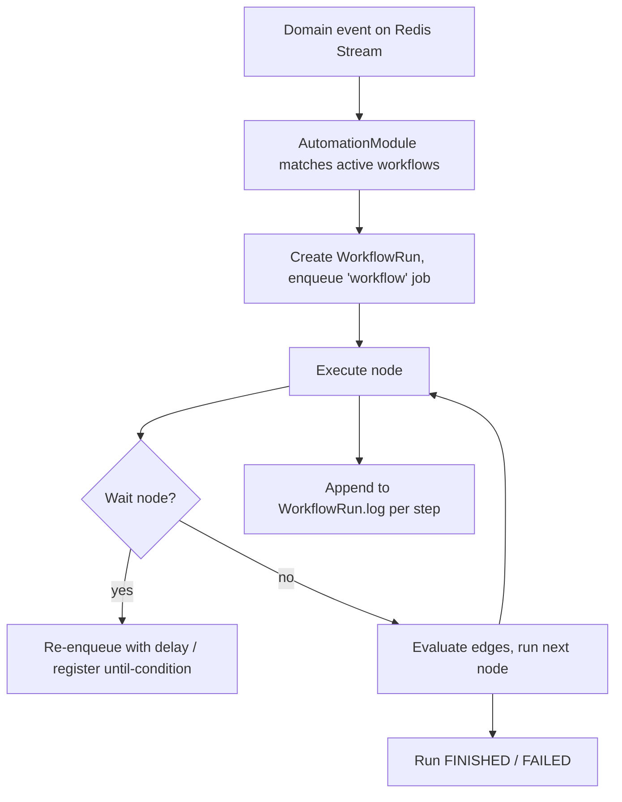

# 12 — Workflow / Automation Engine

A visual, node-based automation builder ("if website broken → wait 3d → email → if no reply → follow-up →
notify rep → create task"). Stored as a graph, executed reactively via the queue.

## 1. Model

A workflow is a **directed graph** of nodes: one **trigger**, then **conditions/branches** and **actions**.
Stored in `Workflow.graph = { nodes, edges }` and `Workflow.trigger = { type, config }` (Doc 04 §9).

```
Trigger ──▶ [Condition?] ──true──▶ Action ──▶ [Wait] ──▶ [Condition?] ──▶ Action
                    └─false─▶ Action/End
```

## 2. Node types

**Triggers** (subscribe to the domain event bus, Doc 05 §5):
- `lead.created`, `lead.scored` (e.g., score ≥ N / websiteScore ≤ N)
- `audit.completed` (e.g., has finding `NO_SSL`)
- `stage.changed`, `email.replied`, `email.bounced`, `email.opened`
- `schedule` (cron), `manual` (run on selection)

**Conditions** — evaluate the Filter DSL (Doc 04 §11) against the triggering entity + related data
(`websiteScore ≤ 30`, `country = US`, `contact.emailStatus = VALID`). Branches: true/false, or switch on a field.

**Actions:**
- `send_email` (from a campaign step / mailbox), `enroll_in_campaign`, `unenroll`
- `enqueue_enrichment`, `enqueue_verify`, `reaudit`
- `assign_to`, `change_stage`, `add_tag`, `create_task`, `create_deal`
- `notify` (in-app / Slack / Discord / email)
- `push_integration` (HubSpot/Sheets/Zapier)
- `ai_write` (Outreach Copywriter, Doc 09)
- `wait` (delay: fixed / until-time / until-condition)
- `webhook_out` (arbitrary POST, allowlisted)

## 3. Execution model



- Each node execution is a queue step → **resumable, retryable, and logged** (`WorkflowRun.log` is the visible run trace in the UI).
- **Waits** don't hold a worker: a `wait 3d` re-enqueues a delayed job; an "until no reply" wait registers a condition the event bus can satisfy early (a reply cancels the wait branch).
- **Idempotency:** a `(workflowRunId, nodeId)` key prevents a retried step from firing an action twice (no double emails).
- **Guardrails:** per-org action-rate caps (can't send 10k emails/min via a loop); loop/cycle detection at publish; a dry-run mode that logs would-fire actions without executing.

## 4. Safety & governance

- Publishing validates the graph (one trigger, reachable nodes, no infinite loops, all referenced campaigns/mailboxes exist).
- Send actions respect suppression + unsubscribe + verification gates (same as manual sending, Doc 03 §4).
- Every action a workflow takes writes an `Activity` on the lead/deal and, if sensitive, an `AuditLog` entry — so "why did this lead get emailed?" is always answerable.
- Workflows are versioned; editing a live workflow creates a new version; in-flight runs finish on their version.

## 5. Builder UX (frontend)

- React Flow canvas: drag nodes from a palette (triggers/conditions/actions), connect edges, configure in a side panel.
- Condition builder reuses the same Filter DSL UI as the Lead Database (one mental model).
- Live "test with a sample lead" → shows the path it would take + would-fire actions.
- Run history tab: each `WorkflowRun` with its step-by-step log and status.

## 6. Example (the canonical one, as stored)

```jsonc
{
  "trigger": { "type": "lead.scored", "config": { "when": { "field":"websiteScore","op":"lte","value":30 } } },
  "nodes": [
    { "id":"c1","type":"condition","config":{ "field":"primaryContact.emailStatus","op":"eq","value":"VALID" } },
    { "id":"a1","type":"enqueue_verify" },
    { "id":"a2","type":"enroll_in_campaign","config":{ "campaignId":"broken_site" } },
    { "id":"w1","type":"wait","config":{ "days":3 } },
    { "id":"c2","type":"condition","config":{ "field":"enrollment.replied","op":"eq","value":true } },
    { "id":"a3","type":"notify","config":{ "channel":"slack","target":"#sales" } },
    { "id":"a4","type":"create_task","config":{ "title":"Follow up — replied" } },
    { "id":"a5","type":"send_email","config":{ "step":"followup_1" } }
  ],
  "edges": [
    { "from":"trigger","to":"c1" },
    { "from":"c1","to":"a2","when":"true" },
    { "from":"c1","to":"a1","when":"false" },
    { "from":"a1","to":"a2" },
    { "from":"a2","to":"w1" },
    { "from":"w1","to":"c2" },
    { "from":"c2","to":"a3","when":"true" }, { "from":"a3","to":"a4" },
    { "from":"c2","to":"a5","when":"false" }
  ]
}
```
